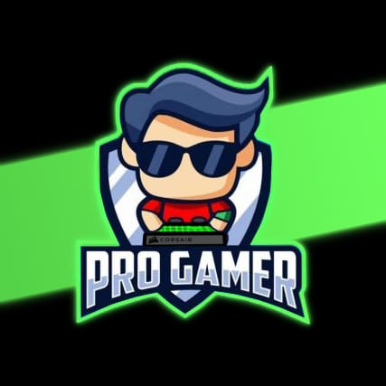

# ProGamer - APIs

- [MVC](https://github.com/LuqueJuanManuel/Grupo_10_ProGamer)

- [Dashboard](https://github.com/TomasLopezTur/Dashboard_Pro-gamer_Grupo10)

## ¿Quienes somos?

Pro Gamer es un E-commerce pensado para ofrecer articulos y elementos de Tecnologia, como por ejemplo Computadoras, Netbook, teclados, mouse, etc.

Lo que brindamos en nuestra pagina, es una buena experiencia de navegación para el Usuario, para que al momento de buscar lo que necesita no solo sea facil, sino que pueda despejar sus dudas sobre lo que busca y quedar satisfecho a la hora de comprar lo que necesita.

El publico al que apunta nuestra pagina, es a todos! ya que unas de nuestras caracterizticas es ofrecer combos u ofertas de articulos variados para todo tipo de usuario, por ejemplo en la zona de elementos destacados ofrecemos por ejemplo: 
- Combo de Pc Gaming,enfocado a aquellos que buscan sacarle el maximo potencial a sus videos Juegos favoritos.
- Combo de Pc Profesional, destinada a aquellas personas que quieren aprovechar su PC para el uso laboral.
- Combo Economico, para las personas que quieran comenzar con su primer PC o para uso de estudio o necesidades basicas.

Entre otras cosas a destacar de nuestra pagina, una de ellas el "Dejanos tus dudas y preguntas" que cumple no solo la funcion de que el usuario califique su experiencia, si no tambien pueda despejar sus dudas o preguntas sobre algun articulo, como por ejemplo si el componente es compatible con su pc, cual pose un mejor "precio/calidad", etc.

***

## Grupo 10

## Equipo de trabajo

### Luque Juan M. 29 años.
- Estudiante de programación Web Full Stack, Apasionado por la Tecnologia, tanto Hardware como Software.
- Me coinsidero una persona que siempre esta en busca de aprender cosas nuevas.

### Tomás López Turconi, 31 años.
- Soy estudiante de Desarrollo web Node full stack y de Python, con ganas de mejorar tanto personal y profesionalmente.
- Interesado e amante de la tecnología como en el hardware, software, robótica, IA, Deep L. y Machine L. Con muchas ganas de aprender.

### Gastón Adán Praettestein, 36 años.
- Estudiante de Programación Web Full Stack, apasionado por este nuevo mundo que comencé a conocer hace poquito, con el que quiero seguir creciendo y aprendiendo.
- Me considero una persona curiosa, apasionada he inquieta a la hora de querer crecer tanto profesional, como personalmente.

### Emanuel Gauna, 32 años.
- Estudiante de programación full stack. me gusta la parte de programación y diseño, de paginas web. Atento a seguir las nuevas tecnologías y empezar algún proyecto a gran escala.
- Soy contratista en construcción, rama: yesería y seria para mi un gran logro crear un sitio que una mis dos pasiones; construcción y programación. ¡A seguir codeando!…

***

## Link al documento o plataforma que utilicen para organizar el trabajo.

[Tablero Trello](https://trello.com/b/GTtHK1Zq)
